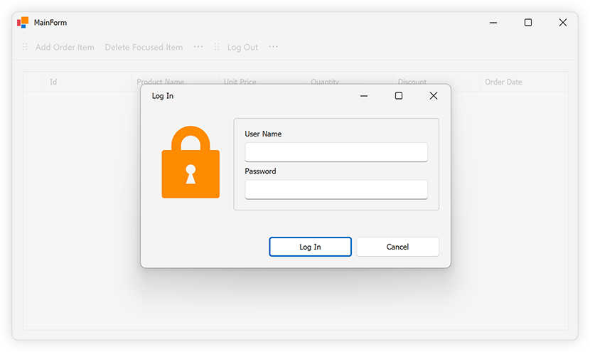
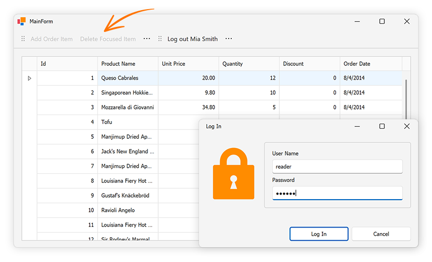

<!-- default badges list -->

[](https://supportcenter.devexpress.com/ticket/details/T1258223)
[](https://docs.devexpress.com/GeneralInformation/403183)
[](#does-this-example-address-your-development-requirementsobjectives)
<!-- default badges end -->
# Connect a WinForms Data Grid to an ASP.NET Core WebAPI Service Powered by EF Core — Authenticate Users and Protect Data

> **NOTE**: This example extends the capabilities (introduces user login and permission-based access control) in the following example: [Connect the DevExpress WinForms Data Grid to a .NET Core Service and Enable Data Editing](https://github.com/DevExpress-Examples/connect-winforms-grid-to-dotnetcore-service-enable-editing).
>
> Refer to the following step-by-step tutorial to run the example: [Getting Started](https://github.com/DevExpress-Examples/connect-winforms-grid-to-dotnetcore-service?tab=readme-ov-file#getting-started).

This example adds a key security feature to the application: user login and permission-based access control (uses Resource Owner Password Credentials ([ROPC](https://learn.microsoft.com/en-us/entra/identity-platform/v2-oauth-ropc)) for authentication).

## Run and Configure Keycloak

Follow the steps below to set up and configure [Keycloak](https://www.keycloak.org/), an open-source identity and access management framework. Our example uses Docker to run Keycloak locally and configure roles/users:

1. Install [Docker](https://www.docker.com/products/docker-desktop/).
2. Execute the following command to run Keycloak in a Docker Container:

    ```
    > docker run -p 8080:8080 -e KEYCLOAK_ADMIN=admin -e KEYCLOAK_ADMIN_PASSWORD=admin -v ./data:/opt/keycloak/data quay.io/keycloak/keycloak:latest start-dev
    ```

    * `-e KEYCLOAK_ADMIN`, `-e KEYCLOAK_ADMIN_PASSWORD` -- set the initial admin credentials.
    * `-v ./data:/opt/keycloak/data` -- mounts the container's data directory to your host for persistence purposes.
    * `-p 8080:8080` -- exposes Keycloak on port 8080 of your host machine.
3. Access Keycloak Admin Console
    * Open your browser and go to `http://localhost:8080/admin`.
    * Log in using the admin credentials set in the previous step (admin/admin).
4.	Create a New Realm
    * In the left navigation menu, navigate to **Clients** and click **Create Client**.
    * Set a Client ID (for example, app1) and click **Next**.
    * Ensure **Direct access grants** is enabled, then click **Save**.
5. Create a Role
    * Navigate to **Realm Roles** in the left menu and click **Create role**.
    * Name the role (e.g., *writers*) and click **Save**.
6.	Adjust Login Settings
    * Go to **Realm Settings** | **Login** tab.
    * Disable **Login with email**.
    * In the **User Profile** tab, disable the **Required field** for email.
7.	Create a User
    * Go to **Users** and click **Create a new user**.
    * Set Username (for example, *writer*), random first/last names, and save the account.
    * In the **Credentials** tab, set a password and deselect **Temporary**.
8.	Assign Role to the User
    
    Go to **Role mapping**, filter by realm roles, and assign the `writers` role.
9.	Create a Reader User
    
    Repeat steps 7 and 8 for a second user (for example, *reader*), but do not assign a role.

## Activate Authentication and Authorization on the Server

1. Configure JWT Authentication

    * In your DataService app, extend service initialization to use JWT Bearer authentication.
    * Add the following code to configure `TokenValidationParameters` in the *Startup* or *Program* class. This ensures that incoming requests are validated using JWT tokens issued by your Keycloak server:

        ```csharp
        options.TokenValidationParameters = new TokenValidationParameters {
            ValidateIssuer = true,
            ValidIssuer = $"{builder.Configuration["Jwt:KeycloakUrl"]}/realms/{builder.Configuration["Jwt:Realm"]}",
            ValidateAudience = true,
            ValidAudience = builder.Configuration["Jwt:Audience"],
            ValidateLifetime = true,
            ValidateIssuerSigningKey = true,
            IssuerSigningKey = publicKey
        };
        ```
2. Ensure your *appsettings.json* contains correct JWT settings. Adjust values to match your Keycloak configuration if necessary.

    ```json
    "Jwt": {
      "Issuer": "http://localhost:8080/realms/winappdemo",
      "Audience": "account",
      "KeycloakUrl": "http://localhost:8080",
      "Realm": "winappdemo"
    }
    ```
3. Add Authorization Policies

    * Define a policy for the role writers in the *Startup* or *Program* class:

        ```csharp
        builder.Services.AddAuthorization(o => {
            o.AddPolicy("writers", p => p.RequireRealmRole("writers"));
        });
        ```
    * Use the `RequireRealmRole` method to validate the role:

        ```csharp
        public static class PolicyHelpers {
            public static void RequireRealmRole(this AuthorizationPolicyBuilder policy, string roleName) {
                policy.RequireAssertion(context => {
                    var realmAccess = context.User.FindFirst("realm_access")?.Value;
                    if (realmAccess == null) return false;
                    var node = JsonNode.Parse(realmAccess);
                    if (node == null || node["roles"] == null) return false;
                    var array = node["roles"]!.AsArray();
                    return array.Select(r => r?.GetValue<string>()).Contains(roleName);
                });
            }
        }
        ```
4. Protect API Endpoints

    Use the `RequireAuthorization` method to secure API endpoints:

    * For open endpoints (e.g., `/api/populateTestData`), no authorization is required.
    * GET endpoints `/data/OrderItems` and `/data/OrderItem/{id}` call `RequireAuthorization()`, so that an authenticated user is required to successfully execute them, but no specific roles are needed.
    * The remaining endpoints POST to `/data/OrderItem`, and PUT and DELETE to `/data/OrderItem/{id}`, call `RequireAuthorization("writers")`, so that policy writers is applied and realm role writers is required.

    The example of the POST endpoint:

    ```csharp
    app.MapPost("/data/OrderItem", async (DataServiceDbContext dbContext, OrderItem orderItem) => {
        dbContext.OrderItems.Add(orderItem);
        await dbContext.SaveChangesAsync();
        return Results.Created($"/data/OrderItem/{orderItem.Id}", orderItem);
    }).RequireAuthorization("writers");
    ```

## Enable User Logins in the WinForms App

The `LoginForm` prompts users for username and password. The form contains two DevExpress TextEdit controls for `username` and `password` fields.



When a user clicks the "Log In" button, the LogIn form collects user credentials and sends a POST request to the Keycloak server to retrieve an access token:

```csharp
// LoginForm.cs
private async void loginButton_Click(object sender, EventArgs e) {
    //...
    if (await DataServiceClient.LogIn(userNameEdit.Text, passwordEdit.Text)) {
        this.DialogResult = DialogResult.OK;
        this.Close();
    }
    else {
        XtraMessageBox.Show("Username or password are invalid, or a technical error occurred.", "Error",
            MessageBoxButtons.OK, MessageBoxIcon.Error);
    }
}

// DataServiceClient.cs
public static async Task<bool> LogIn(string username, string password) {
    //...
    var content = new FormUrlEncodedContent(new Dictionary<string, string> {
        {"client_id", clientId},
        {"username", username},
        {"password", password},
        {"grant_type", "password"}
    });
    var url = $"{authUrl}/realms/{realm}/protocol/openid-connect/token";
    var response = await bareHttpClient.PostAsync(url, content);
    try {
        response.EnsureSuccessStatusCode();
        var responseString = await response.Content.ReadAsStringAsync();
        (accessToken, refreshToken, expiresIn) = GetTokens(responseString);
        if (accessToken != null) {
            lastRefreshed = DateTime.Now;
            (name, realmRoles) = GetUserDetails(accessToken);
        }
        return true;
    }
    catch (Exception ex) {
        Debug.WriteLine(ex);
        return false;
    }
}
```

The `GetTokens` method parses the JSON response from Keycloak and extracts `access_token`, `refresh_token`, and `expires_in` fields:

```csharp
static (string? access_token, string? refresh_token, int? expires_in) GetTokens(string jsonString) {
    var node = JsonNode.Parse(jsonString);
    if (node == null)
        return (null, null, null);
    else
        return (node["access_token"]?.GetValue<string>(),
            node["refresh_token"]?.GetValue<string>(),
            node["expires_in"]?.GetValue<int>());
}
```

A client must check the validity and expiration of an access token before its use and use the `refreshToken` to retrieve a new access token if the old one has expired (see the [BearerTokenHandler](./CS/WinForms.Client/DataServiceClient.cs) class). The Authorization request header is configured to pass the value of the current access token to the server using a specific format:

```csharp
protected override async Task<HttpResponseMessage> SendAsync(HttpRequestMessage request, CancellationToken cancellationToken) {
    if (!String.IsNullOrWhiteSpace(accessToken)) {
        //...
        request.Headers.Authorization = new AuthenticationHeaderValue("Bearer", accessToken);
    }
    return await base.SendAsync(request, cancellationToken);
}
```

The client application can now authenticate against the Keycloak server and send an access token to the data service (confirming permission to access data endpoints). The server determines the roles associated with a specific logged-in user account and allows/denies access to endpoints accordingly.

## Configure UI Based on Access Permissions

### Decode the Access Token

Once the user logs in and the accessToken is retrieved, decode the token on the client side to access the user's roles. Add the `System.IdentityModel.Tokens.Jwt` NuGet package to your project to handle JWT decoding.

The `GetUserDetails` method extracts user details such as username and roles:

```csharp
static (string? name, string?[] realmRoles) GetUserDetails(string? accessToken) {
    if (String.IsNullOrEmpty(accessToken))
        return (null, []);
    var handler = new JwtSecurityTokenHandler();
    var token = handler.ReadJwtToken(accessToken);

    var claim = (string claimType) => token.Claims.FirstOrDefault(c => c.Type == claimType)?.Value;
    var name = claim("name");
    var realmAccess = claim("realm_access");
    var node = JsonNode.Parse(realmAccess);
    if (node == null || node["roles"] == null) return (name, []);
    var array = node["roles"]!.AsArray();
    var realmRoles = array.Select(r => r?.GetValue<string>()).ToArray();

    return (name, realmRoles);
}
```

### Evaluate User Roles

Evaluate user roles to determine which UI elements to enable/disable. The `EvaluateRoles` method enables/disables UI elements based on roles available to the user:

```csharp
// MainForms.cs
private void EvaluateRoles() {
    if (DataServiceClient.LoggedIn) {
        if (DataServiceClient.UserHasRole("writers")) {
            userIsWriter = true;
            addItemButton.Enabled = true;
            deleteItemButton.Enabled = true;
        }
        else {
            userIsWriter = false;
            addItemButton.Enabled = false;
            deleteItemButton.Enabled = false;
        }
    }
    else {
        userIsWriter = false;
        addItemButton.Enabled = false;
        deleteItemButton.Enabled = false;
    }
}
```



## Files to Review

* [DataService\Program.cs](./CS/DataService/Program.cs)
* [LoginForm.cs](./CS/WinForms.Client/LoginForm.cs)
* [MainForm.cs](./CS/WinForms.Client/MainForm.cs)
* [DataServiceClient.cs](./CS/WinForms.Client/DataServiceClient.cs)


## Related Examples

* [Connect the DevExpress WinForms Data Grid to a .NET Core Service](https://github.com/DevExpress-Examples/connect-winforms-grid-to-dotnetcore-service)
* [Connect the DevExpress WinForms Data Grid to a .NET Core Service and Enable Data Editing](https://github.com/DevExpress-Examples/connect-winforms-grid-to-dotnetcore-service-enable-editing)
* [Connect the DevExpress WinForms Data Grid to a Backend using a Middle Tier Server (EF Core without OData)](https://github.com/DevExpress-Examples/connect-winforms-grid-to-backend-using-middletier-server)

## See Also

* [Connect a WinForms Data Grid to an Arbitrary ASP.NET Core WebAPI Service Powered by EF Core — Architecture and Data Binding (Part 1)](https://community.devexpress.com/blogs/news/archive/2024/08/30/connect-a-winforms-data-grid-to-a-net-core-service.aspx)
* [Connect a WinForms Data Grid to an Arbitrary ASP.NET Core WebAPI Service Powered by EF Core — Add Editing Features (Part 2)](https://community.devexpress.com/blogs/news/archive/2024/09/06/connect-a-winforms-data-grid-to-an-arbitrary-asp-net-core-webapi-service-powered-by-ef-core-add-editing-features.aspx)
* [Connect a WinForms Data Grid to an Arbitrary ASP.NET Core WebAPI Service Powered by EF Core — Authenticate Users and Protect Data (Part 3)](https://community.devexpress.com/blogs/news/archive/2024/10/08/connect-a-winforms-data-grid-to-an-arbitrary-asp-net-core-webapi-service-powered-by-ef-core-authenticate-users-and-protect-data.aspx)

<!-- feedback -->
## Does this example address your development requirements/objectives?

[](https://www.devexpress.com/support/examples/survey.xml?utm_source=github&utm_campaign=connect-winforms-grid-to-dotnetcore-service-enable-pbac&~~~was_helpful=yes) [](https://www.devexpress.com/support/examples/survey.xml?utm_source=github&utm_campaign=connect-winforms-grid-to-dotnetcore-service-enable-pbac&~~~was_helpful=no)

(you will be redirected to DevExpress.com to submit your response)
<!-- feedback end -->
